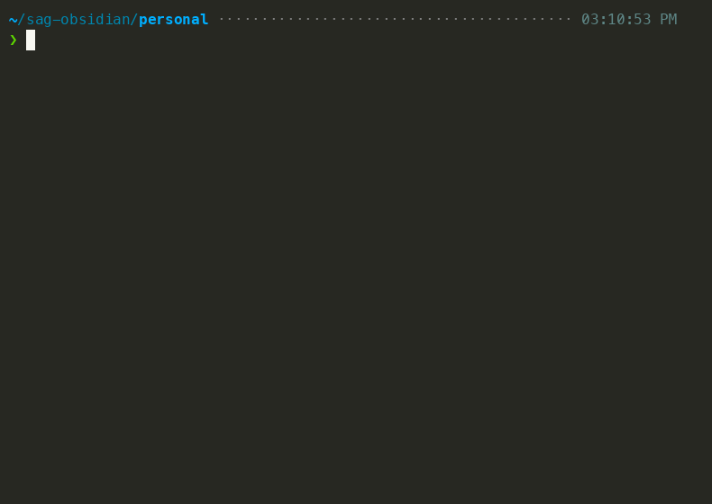
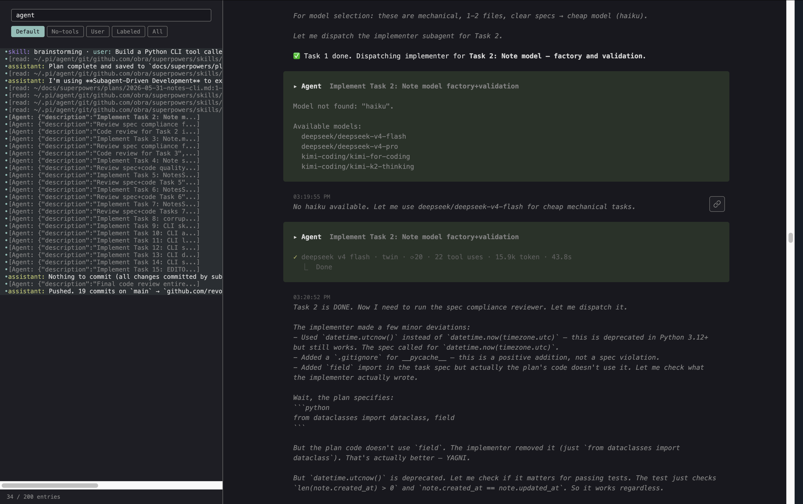
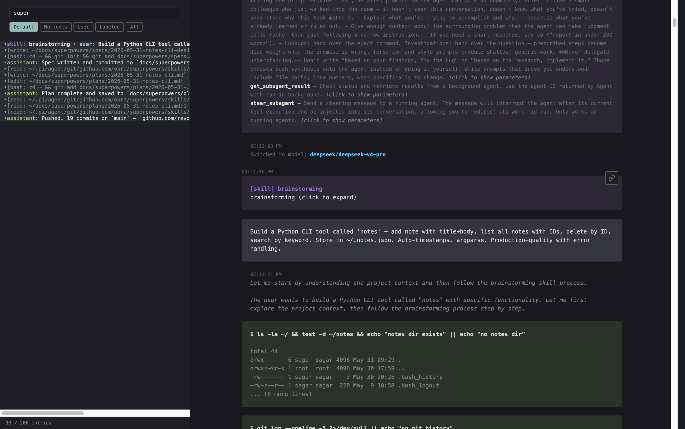

# notes

## Pi Setup

Install extensions used in this demo:

```bash
pi install npm:pi-mcp-adapter
pi install npm:pi-web-access
pi install npm:pi-caveman
pi install npm:@tintinweb/pi-subagents
pi install https://github.com/obra/superpowers
```


A production-quality personal notes CLI tool. Store notes in `~/.notes.json`, search by keyword, manage with simple subcommands. Zero external dependencies — stdlib only.

## Install

```bash
pip install -e .
```

Or run directly without installing:

```bash
PYTHONPATH=. python3 -m notes.cli <command>
```

## Usage

### Add a note

```bash
notes add "Shopping List" -b "Buy milk, eggs, bread"
```

Omit `-b` to open `$EDITOR` for the body (falls back to stdin if `$EDITOR` is unset).

### List all notes

```bash
notes list
```

Output:

```
  [abc123def456...]  Shopping List
  [789xyz...]  Meeting Notes
```

Newest first.

### Show a note

```bash
notes show abc123def456
```

### Search notes

```bash
notes search milk
```

Case-insensitive substring match in title and body.

### Delete a note

```bash
notes delete abc123def456
```

## Storage

Notes stored in `~/.notes.json`. Atomic writes prevent corruption on crash. Corrupt files are backed up to `~/.notes.json.bak` with a warning.

## Architecture

```
notes/
  models.py   — Note dataclass (id, title, body, timestamps)
  store.py    — NotesStore (JSON I/O, atomic writes, corruption recovery)
  cli.py      — argparse CLI (add, list, show, delete, search)
```

## Requirements

- Python 3.10+
- No external dependencies

## Demo



Built entirely by [Pi coding agent](https://github.com/earendil-works/pi) using superpowers skills.

### Session Links

- [pi.dev session](https://pi.dev/session/#f22fe0090dc260925381504d632f9bb6)
- [Gist](https://gist.github.com/sagarsrc/f22fe0090dc260925381504d632f9bb6)
- [Full asciinema recording](pi-skills-demo.cast)

### Skills Showcased

`/skill:brainstorming` → `/skill:writing-plans` → `/skill:subagent-driven-development` → `/skill:test-driven-development` → `/skill:verification-before-completion`





